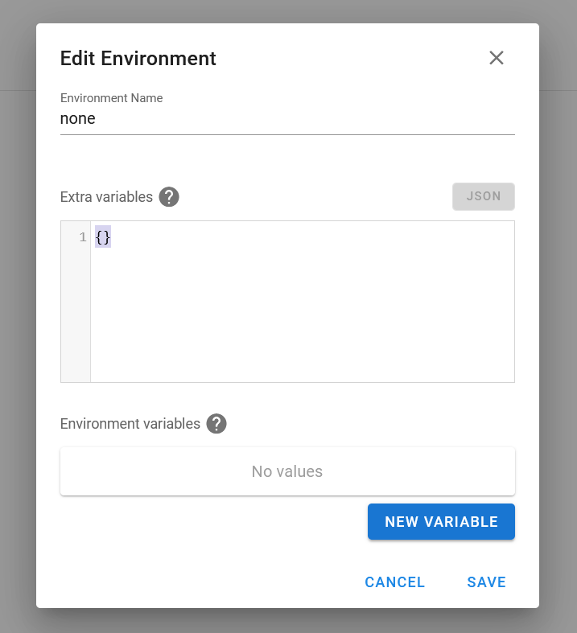

# Proyecto de Sincronización de Archivos de Nginx con Ansible

Este proyecto utiliza Ansible para sincronizar los archivos de configuración de Nginx entre un servidor local y un servidor remoto. También se encarga de crear enlaces simbólicos en el directorio `sites-enabled` de Nginx y reiniciar el servicio después de la sincronización.

## Requisitos

- Tener instalado rsync en la maquina cliente donde se va a trabajar
- Ansible instalado en la máquina desde donde se ejecutará el playbook.
- Acceso SSH al servidor remoto donde se encuentra Nginx.
- Permisos de superusuario (sudo) en el servidor remoto.


- Se le agrego una opcion para no tener que eliminar el fichero del virtualhost del servidor, simplemente al agregarle -off al final este ya 
no pasara al directorio sites-enabled

ejemplo

ansible.hlg.sld.cu.conf

ansible.hlg.sld.cu.conf-off


## Estructura del Proyecto

```
.
├── ansible.cfg
├── hosts
└── playbooks
    └── sync_nginx_files.yml
```

- `ansible.cfg`: Archivo de configuración de Ansible (opcional).
- `hosts`: Archivo de inventario que define los hosts donde se aplicará el playbook.
- `playbooks/sync_nginx_files.yml`: El playbook de Ansible que realiza la sincronización y configuración.

## Configuración

1. Asegúrate de tener los archivos de configuración de Nginx en la carpeta `sites-available-rsync/` en tu máquina local.

2. Modifica el archivo `hosts` para incluir la información del servidor remoto donde se encuentra Nginx. Por ejemplo:

   ```
   [Server_Local_Docker]
   10.10.10.110 ansible_user=ubuntu ansible_ssh_private_key_file=~/.ssh/id_rsa
   ```

3. Ajusta las rutas en el playbook `sync_nginx_files.yml` según tus necesidades:

   ```yaml
   - name: Copiar contenido de la carpeta sites-available al servidor Ngnix1
     hosts: Server_Local_Docker
     become: yes

     tasks:
       - name: Copiar carpeta usando rsync
         synchronize:
           src: sites-available-rsync/
           dest: /home/PruebaAnsible/Rsync/
           delete: yes
           recursive: yes
           checksum: yes
           archive: yes
           compress: yes

       - name: Establecer permisos y propietario en los archivos copiados
         file:
           path: /home/PruebaAnsible/Rsync/
           mode: "u=rw,g=r,o=r"
           owner: nginx
           group: root
           recurse: yes

       - name: Crear enlaces simbólicos en sites-enabled
         file:
           src: /home/PruebaAnsible/Rsync/{{ item }}
           dest: /etc/nginx/sites-enabled/{{ item }}
           state: link
         loop: "{{ lookup('fileglob', '/home/PruebaAnsible/Rsync/*') | map('basename') | list }}"
         notify: Reiniciar Nginx

     handlers:
       - name: Reiniciar Nginx
         service:
           name: nginx
           state: restarted
   ```

## Uso

1. Asegúrate de tener los archivos de configuración de Nginx en la carpeta `sites-available-rsync/` en tu máquina local.

2. Ejecuta el playbook de Ansible:

   ```bash
   ansible-playbook playbooks/sync_nginx_files.yml
   ```

   Esto sincronizará los archivos de configuración, establecerá los permisos y propietario adecuados, creará los enlaces simbólicos en `sites-enabled` y reiniciará Nginx en el servidor remoto.

## Notas

- Asegúrate de tener los permisos adecuados en el servidor remoto para que Ansible pueda realizar las tareas.
- Verifica que el usuario SSH utilizado tenga acceso a los directorios y archivos necesarios en el servidor remoto.
- Ajusta las rutas y permisos según tus requisitos específicos.

## Contribución

Si encuentras algún problema o tienes sugerencias de mejora, no dudes en abrir un issue o enviar un pull request en el repositorio de GitHub.





 <style> .full-size { width: 100% !important; height: auto !important; } </style> <script> function toggleImageSize(img) { img.classList.toggle('full-size'); } </script> Ahora, cuando hagas clic en la imagen, esta alternará entre el tamaño fijo y el tamaño natural, sin redirigir a ninguna otra página.